# Subdomain Finder Bot — Graphical Abstract

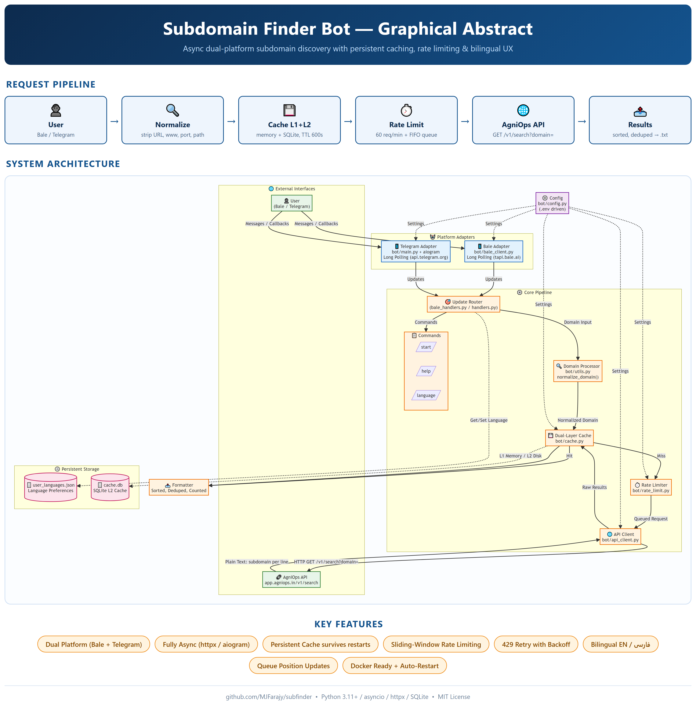

> A visual architecture overview of the dual-platform (Bale/Telegram) subdomain discovery bot with persistent caching, rate limiting, and bilingual support.

---

## 🏗️ System Architecture

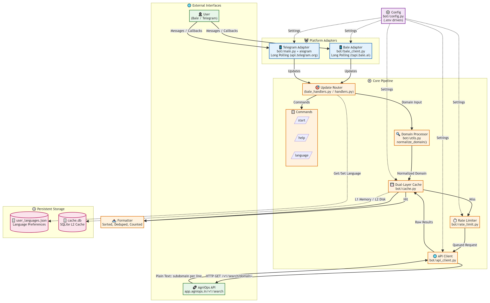

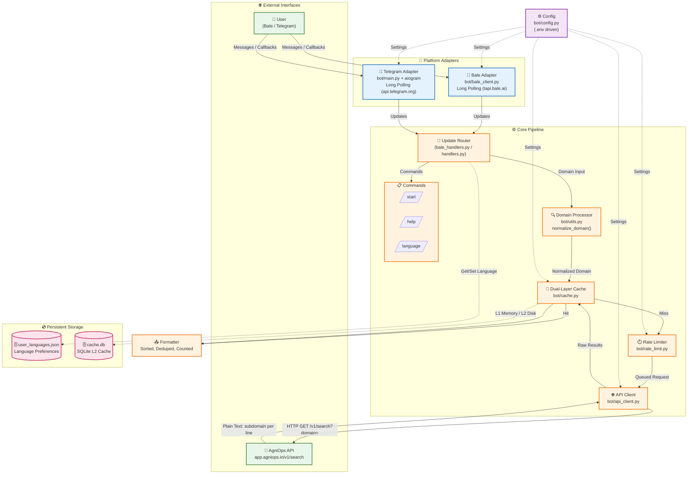

---

## 🔄 Request Flow Sequence

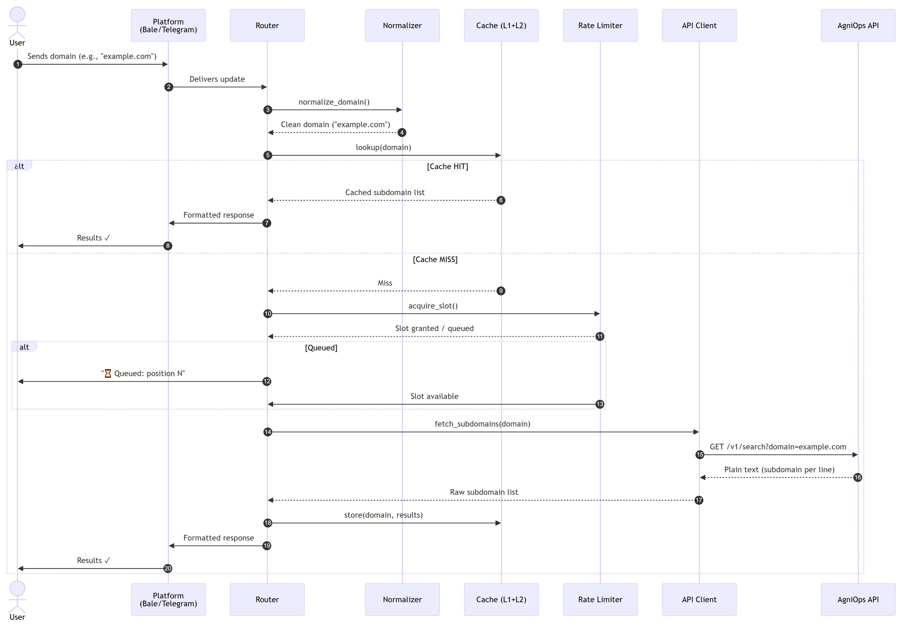

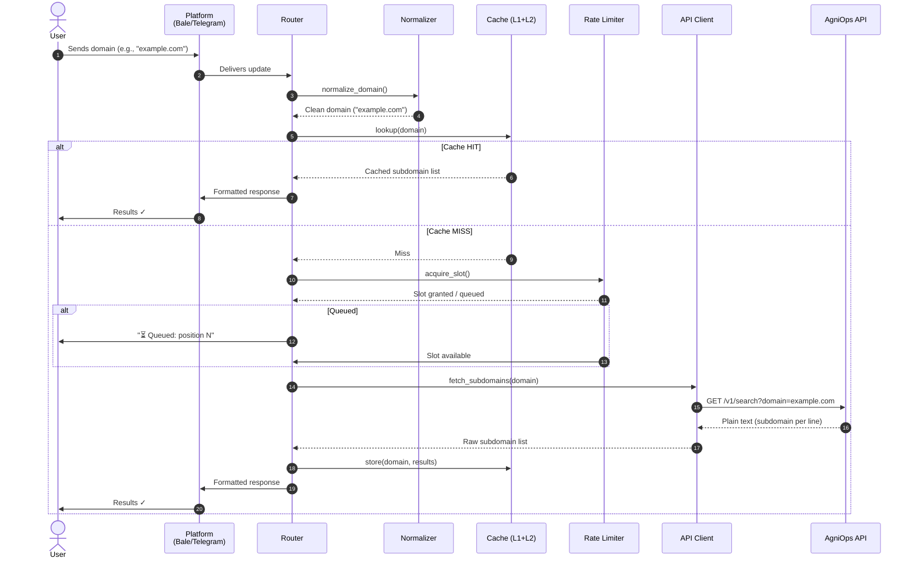

---

## 🧩 Key Components Detail

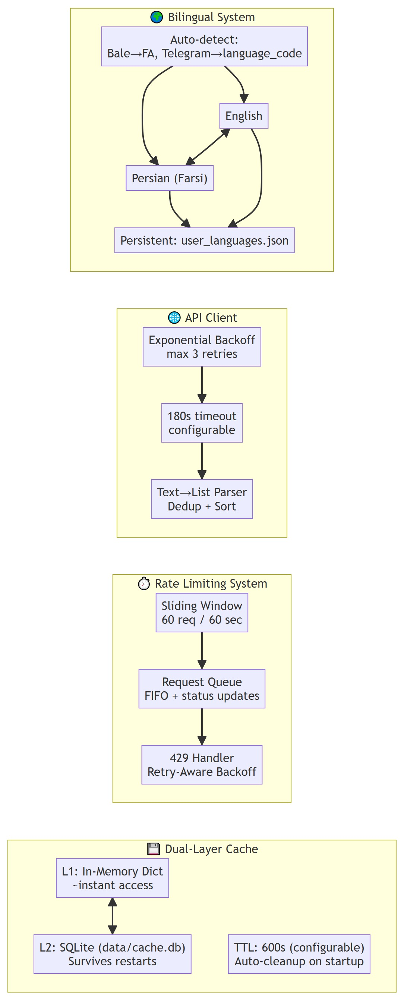

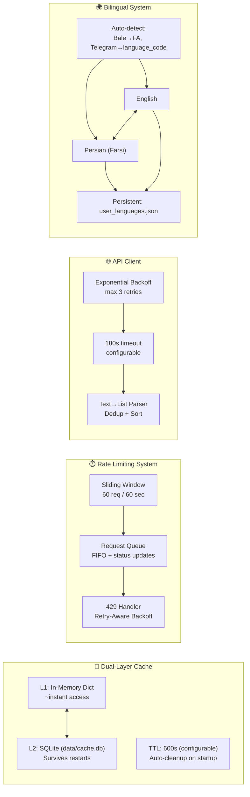

---

## 📊 Feature Matrix

| Feature | Implementation | Location |
|---------|---------------|----------|
| **Dual Platform** | Bale (no VPN) + Telegram (proxy) | `bale_main.py` / `main.py` |
| **Subdomain Discovery** | AgniOps API (GET /v1/search) | `api_client.py` |
| **Input Normalization** | URL/domain/port/path stripping | `utils.py:normalize_domain()` |
| **L1 + L2 Cache** | Memory dict + SQLite + TTL | `cache.py` |
| **Global Rate Limit** | Sliding window 60/min + queue | `rate_limit.py` |
| **Queue UX** | Position + periodic updates | `rate_limit.py` + handlers |
| **429 Handling** | Header-aware backoff | `api_client.py` + `rate_limit.py` |
| **Bilingual (EN/FA)** | Inline keyboard + persistence | `i18n.py` + `language_store.py` |
| **Large Results** | `.txt` file upload | `handlers.py` / `bale_handlers.py` |
| **Auto-Restart** | Shell/bat scripts + systemd/task | `scripts/` |
| **Docker** | Multi-stage build | `Dockerfile` |
| **Testing** | Pytest + async mocks | `tests/` |

---

## 🚀 Deployment Topology

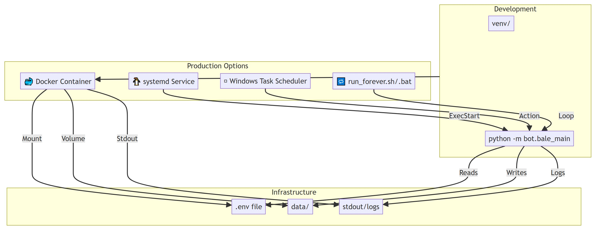

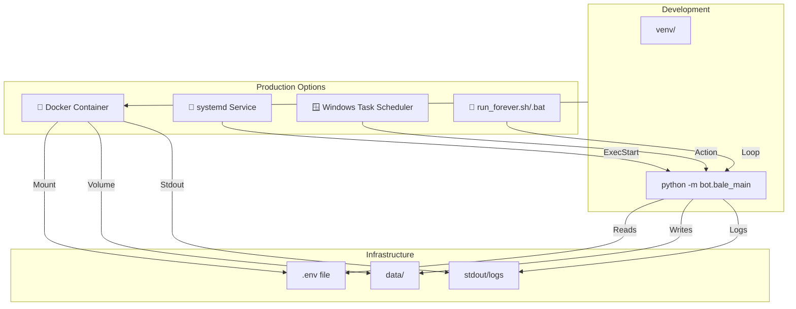

---

## 🎯 Design Principles

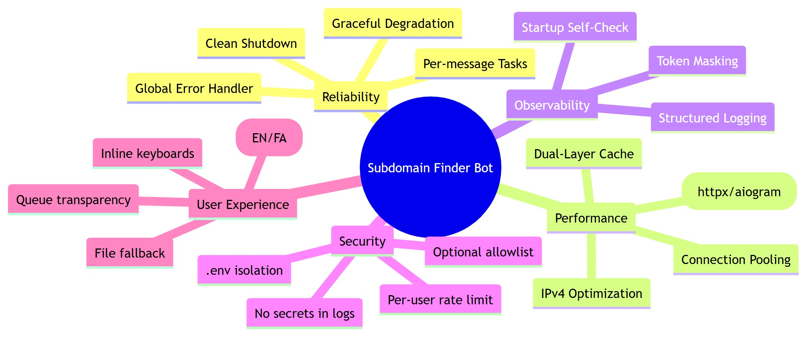

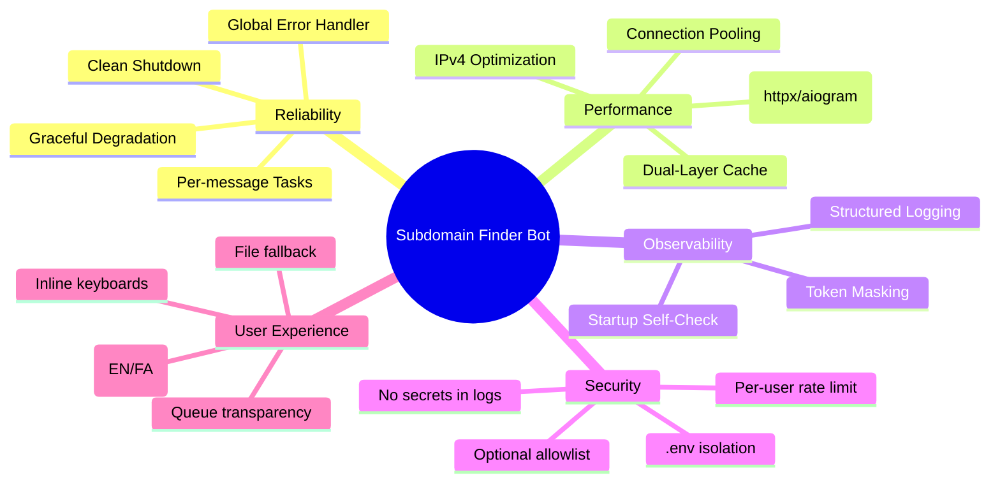

---

## 📝 Quick Reference: Data Flow

```
User Input
    │
    ▼
┌─────────────────────┐
│ normalize_domain()  │  ← strips scheme, www, path, port, query
└─────────┬───────────┘
          │
          ▼
┌─────────────────────┐
│ Cache Lookup (L1→L2)│  ← key: normalized domain
└─────────┬───────────┘
    Hit  /  Miss
    │         │
    ▼         ▼
Return    Rate Limit
Cached    Acquire Slot
          │
          ▼
    ┌─────────────┐
    │ API Request │  ← GET https://app.agniops.in/v1/search?domain=
    │  (retries)  │
    └──────┬──────┘
           │
           ▼
    ┌─────────────┐
    │ Parse &     │  ← split lines, dedupe, sort, count
    │ Format      │
    └──────┬──────┘
           │
           ▼
    ┌─────────────┐
    │ Store in    │  ← L1 + L2 with TTL
    │ Cache       │
    └──────┬──────┘
           │
           ▼
    ┌─────────────┐
    │ Send to     │  ← Markdown (TG) / Markdown (Bale)
    │ Platform    │     >4000 chars → .txt file
    └─────────────┘
```

---

*Generated for **Subdomain Finder Bot** — A robust, bilingual, dual-platform subdomain discovery service.*